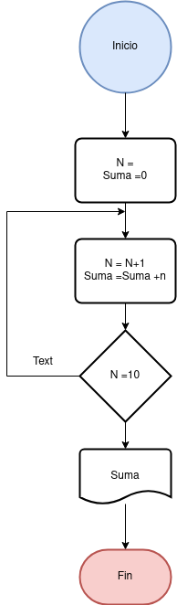

## Ejercico 3 

Desarrolle un algoritmo que realice la sumatoria de los números enteros comprendidos entre el 1 y el 10,
es decir, 1 + 2 + 3 + .... + 10.

### Diagrama de Flujo

###  Pseudocódigo

Paso :

* Inicio
* Declaración de variables:
  __N= 0, Suma = 0__
* Asignación Contador :
  __N=N+1__
* Asignación Acumulador:
  __Suma = Suma + N__
* __Si__ N = 10 __Entonces__
* Escribir Suma
* __De lo contrario__  
, Repetir desde el
  paso 3
* __Fin_Si__
* __Fin__

