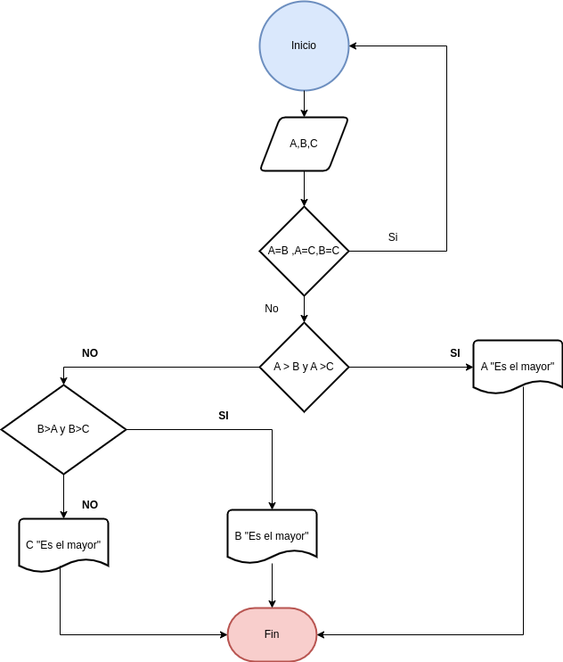
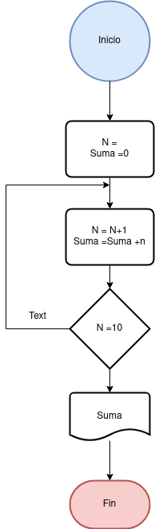

 
# Tareas
  

## Tarea 2 

Desarrolle un algoritmo que permita leer tres valores y almacenarlos en las variables A, B y C respectivamente. El algoritmo debe imprimir cual es el mayor y cual es el menor. Recuerde constatar que los tres valores introducidos por el teclado sean valores distintos. Presente un mensaje de alerta en caso de que se detecte la introducción de valores iguales. 

### Diagrama de Flujo

### Pseudocódigo

Paso:

* __Inicio__
_

* Leer los valores

* Comprobar si los tres valores no son iguales.

* Si Los valos son Iguales volver al principio

* Almacenar en las variables __A__,__B__ y __C__

* Si __A > B y A > C__ Entonces

* Escribir __A "Es el Mayor "__

  si b>c
  B segundo y c es el ultimo

* Sino

* Si __B > A y B > C__ Entonces

* Escribir __B "Es el Mayor"__

* Sino

* Escribir __C "Es el Mayor"__

* __Fin_SI__

* __Fin_SI__

* __Fin__

## Ejercico 3 

Desarrolle un algoritmo que realice la sumatoria de los números enteros comprendidos entre el 1 y el 10,
es decir, 1 + 2 + 3 + .... + 10.
 Utilia un buble __for__ y un bucle __while__.

### Diagrama de Flujo

###  Pseudocódigo

Paso :

* Inicio
* Declaración de variables:
  __N= 0, Suma = 0__
* Asignación Contador :
  __N=N+1__
* Asignación Acumulador:
  __Suma = Suma + N__
* __Si__ N = 10 __Entonces__
* Escribir Suma
* __De lo contrario__  
, Repetir desde el
  paso 3
* __Fin_Si__
* __Fin__

## Ejercico 4 

Desarrolle un algoritmo que permita leer un valor cualquiera N y escriba si dicho número es par o impar.

### Diagrama de Flujo

###  Pseudocódigo

Paso :

* Inicio
 Declaración de Variables: __CatA= 0, CatB=0__
* __Leer__ el valor de cada cateto
* Almacenarlo en la variable __CatA y CatB__

__Calcular__ el valor de Hip con la
formula indicada
* __Escribir__ el valor de la Hipotenusa
* __Fin__

## Ejercico 5 

Desarrolle un algoritmo que permita leer dos números y ordenarlos de menor a mayor, si es el caso.

### Diagrama de Flujo

###  Pseudocódigo

Paso :

## Ejercico 6 

Desarrolle un algoritmo que permita leer un valor entero positivo N y determinar si es primo o no.
### Diagrama de Flujo

###  Pseudocódigo

Paso :

## Ejercico 7 

Realice un algoritmo que a partir de proporcionarle la velocidad de un automóvil, expresada en kilómetros por hora, proporcione la velocidad en metros por segundo.
### Diagrama de Flujo

###  Pseudocódigo

Paso :

## Ejercico 8 
Desarrolle un algoritmo que permita calcular Promedio de Notas; finaliza cuando N = 0.

### Diagrama de Flujo

###  Pseudocódigo

Paso :

## Ejercicio 9 

Muestra los números del 1 al 100 (ambos incluidos). Usa un bucle while.

Haz el mismo ejercicio anterior con un bucle for.

### Diagrama de Flujo

###  Pseudocódigo

Paso :

