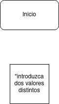

# Ejercicios

- [Ejercicio 1](#ejercico-1)

## Ejercico 1 

Desarrolle un algoritmo que permita leer dos valores distintos, determinar cual de los dos valores es el
mayor y escribirlo.

### Diagrama de Flujo 

###  Pseudocódigo

Paso :

- Inicio

- Inicializar variables: __A = 0, B = 0__

- Solicitar la introducción de dos
    valores distintos
- Leer los dos valores

- Asignarlos a las variables __A__ y __B__

- Si __A = B__  
    Entonces vuelve a 3
    porque los valores deben ser
    distintos

- Si __A>B__   Entonces Escribir __A__, 
    __"Es el mayor"__
- De lo contrario:   Escribir __B__,
    __"Es el mayor"__

- Fin_Si

- Fin

