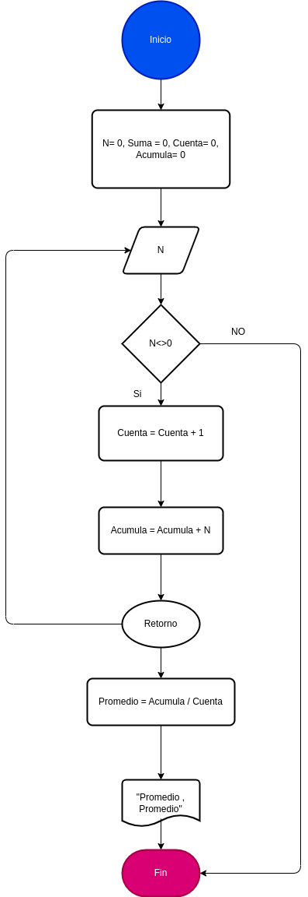

# Ejercicio

##  Desarrolle un algoritmo que permita calcular Promedio de Notas; finaliza cuando N = 0.

## Diagrama de flujos

     

## Pseudocódigo

1. Inicio
2. Declaración de Variables:
 Inicio
N = 0, Promedio = 0, contador= 0
3. Leer N
4. Mientras N > 0 hacer
N = 0, Suma = 0, Cuenta= 0, contador= 0
5. Cuenta = Cuenta + 1
6. contador = contador + N
7. Fin Mientras
8. Promedio = contador/Cuenta
9. Imprimir "Promedio:"; Promedio
10. Fin

