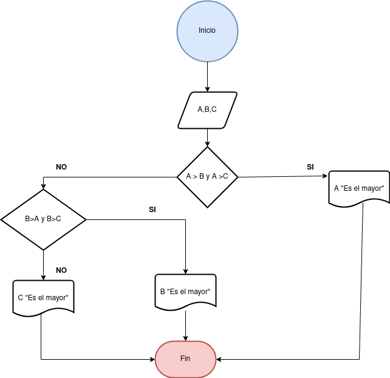

## Ejercico 2 

Desarrolle un algoritmo que realice la sumatoria de los números enteros comprendidos 
entre el 1 y el 10, es decir, 1 + 2 + 3 + …. + 10. Utilia un buble __for__ y un bucle __while__

### Diagrama de Flujo

### Pseudocódigo

Paso:

* __Inicio__

* Inicializar las variables __A__,__B__ y __C__

* Leer los valores

* Almacenar en las variables __A__,__B__ y __C__

* Si __A > B y A > C__ Entonces

* Escribir __A "Es el Mayor "__

* Sino

* Si __B > A y B > C__ Entonces

* Escribir __B "Es el Mayor"__

* Sino

* Escribir __C "Es el Mayor"__

* __Fin_SI__

* __Fin_SI__

* __Fin__

