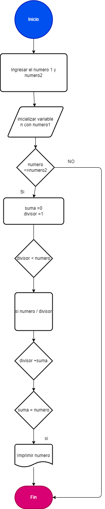

# Ejercicio

##  Un número perfecto es aquel que es igual a la suma de sus divisores propios (excluyendo él mismo). Por ejemplo, 6 es un número perfecto porque sus divisores propios son 1, 2 y 3, y 1 + 2 + 3 = 6.
 
## El ejercicio consiste en escribir un programa que encuentre e imprima todos los números perfectos en un rango dado (por ejemplo, entre 1 y 1000). 

## Diagrama de flujos

     

## Pseudocódigo

1. Ingresar el numero1 del rango ("limiteInferior") y el numero2 ("limiteSuperior").
2. Inicializar una variable (numero)  que es igual a numero1.
3. Mientras numero sea menor o igual a numero2, hacer lo siguiente:
 a. Inicializar una variable (suma) con 0.
 b. Inicializar una variable (divisor) con 1.
 c. Mientras divisor sea menor que numero, hacer lo siguiente:
 Si numero es divisible por divisor, entonces sumar divisor a suma.
 Incrementar divisor en 1.
 d. Si suma es igual a numero, entonces imprimir numero.
 e. Incrementar numero en 1.
4. Fin del programa.

